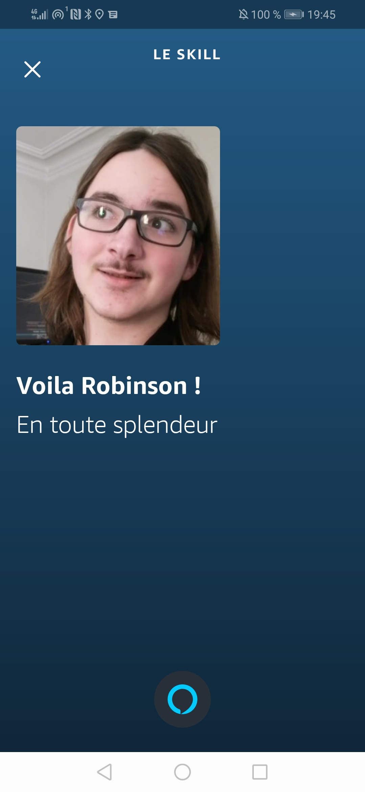
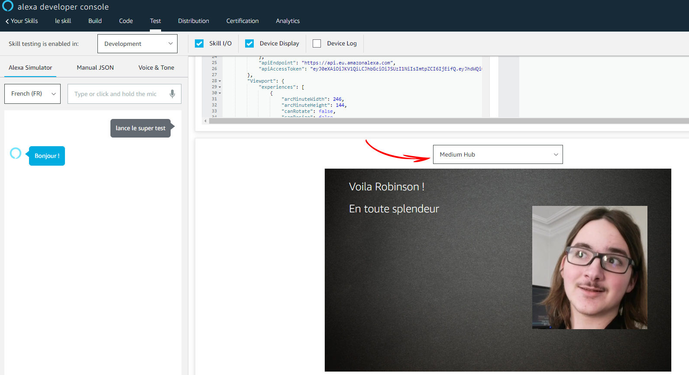
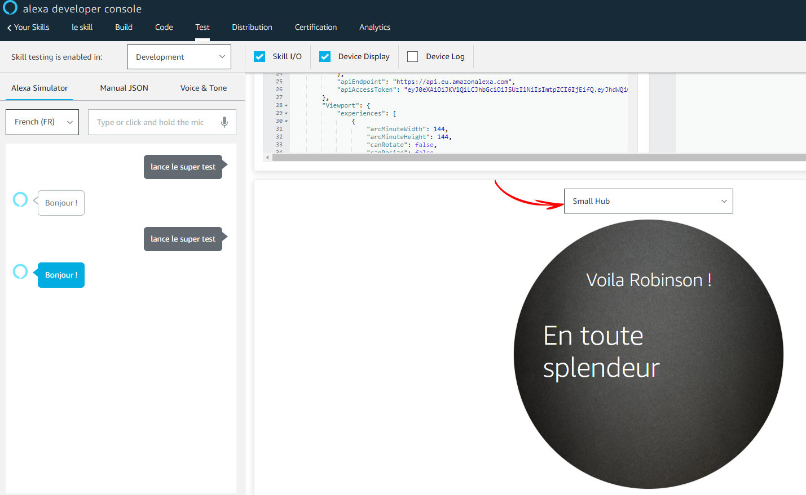

# Carte Basique

**self.show\_basic\_card\(self, title: str, text: str, small\_image\_url: Optional\[str\] = None, large\_image\_url: Optional\[str\] = None\) -&gt; None:**

## Fonctionnement

Vous permet d'afficher une carte avec titre, texte et optionnellement une image. Si vous essayez d'afficher une carte sur un appareil ne pouvant pas l'afficher \(comme une enceinte Alexa qui n'a pas d'écrans\), aucune erreur ne vas se produire, la carte ne seras simplement pas afficher. Si vous souhaitez afficher une image sur un appareil avec une petite taille d'écran \(comme un Echo Spot\), le titre et le texte de la carte seront affichés, cependant l'image sera caché.


Il est possible que votre utilisateur ne voit pas votre carte sur son appareil \(ou même, sur un appareil affichant la carte, il n'est pas garanti que l'utilisateur regarde son écran\). Pour cette raison, sur Alexa \(les autres plateformes sont différentes\), votre expérience devrait utiliser les cartes de manière optionnelle, et ne pas en dépendre.



Vous pouvez re-envoyer une carte comme réponse seule à votre utilisateur. Vous n'êtes pas obligé d'inclure une réponse vocal via la commande self.say\(\) ou quoi que ce soit d'autre. Cependant, vous devriez prévoir que vos utilisateurs n'ont pas d'écrans ou ne les regarde pas.


## Arguments


Le total de caractères quand le titre, le texte et les deux urls optionnel sont combinés, ne doit pas excéder 8000 caractères \(voir [https://developer.amazon.com/fr-FR/docs/alexa/custom-skills/include-a-card-in-your-skills-response.html\#create-a-card-to-display-text-and-an-image](https://developer.amazon.com/fr-FR/docs/alexa/custom-skills/include-a-card-in-your-skills-response.html#create-a-card-to-display-text-and-an-image)\)


### title

_Obligatoire \| Attends une valeur de type str \(texte\)_

Cette argument vous permet de définir le texte qui sera affiché comme le titre de votre carte. En fonction des appareils, il pourras être mis en gros et dans une police de caractères plus grosse.

### text

_Obligatoire \| Attends une valeur de type str \(texte\)_

Cette argument vous permet de définir le texte qui sera affiché comme le contenue de votre carte. Il ne sera pas mis en gras, et la taille de sa police peut s'ajuster en fonction de l'appareil et du nombre de caractères du texte.

### small\_image\_url

_Optionnel \| Attends une valeur de type str \(texte\)_

### large\_image\_url

_Optionnel \| Attends une valeur de type str \(texte\)_


Pour en savoir plus sur les dimensions d'images et pourquoi définir une image basse résolution et une grande résolution, voir [https://developer.amazon.com/fr-FR/docs/alexa/custom-skills/include-a-card-in-your-skills-response.html\#image\_size](https://developer.amazon.com/fr-FR/docs/alexa/custom-skills/include-a-card-in-your-skills-response.html#image_size)


## **Example**

```python
self.say("Bonjour !") # Cette ligne est une réponse vocal non-requise pour la carte
self.alexa.show_basic_card(title="Voila Robinson !", text="En toute splendeur",
    large_image_url="https://s3.eu-west-3.amazonaws.com/www.inoft.com/img/team_robinson_128x128.jpg")
```


Si en essayant le code ci-dessus, une erreur se produit ou que l'image n'apparaît pas, c'est tout simplement car le lien de l'image est mort. Essayer avec un lien vers une autre image \(n'importe lequel que vous trouverez sur internet, à condition qu'elle respecte les conditions d'hébergements d'images pour Alexa\)








## **Usage**


```python
from inoft_vocal_framework import InoftSkill, \
    InoftRequestHandler, InoftDefaultFallback

class LaunchRequestHandler(InoftRequestHandler):
    def can_handle(self) -> bool:
        return self.is_launch_request()

    def handle(self):
        self.say("Bonjour !")
        self.alexa.show_basic_card(title="Voila Robinson !",
            text="En toute splendeur",
            large_image_url="https://s3.eu-west-3.amazonaws.com/www.inoft.com/img/team_robinson_128x128.jpg"
        )
        # Si une erreur se produis ou que l'image n'apparait pas,
        # cela veut dire que le lien de l'image ne fonctionne plus.
        # Utiliser le lien de n'importe quel autre image (tant qu'elle
        # respecte les conditions d'hébergement d'images d'Alexa)
        return self.to_platform_dict()

class DefaultFallback(InoftDefaultFallback):
    def handle(self):
        self.say("J'ai pas compris mon ami !")
        return self.to_platform_dict()

def lambda_handler(event, context):
    skill = InoftSkill()
    skill.add_request_handler(LaunchRequestHandler)
    skill.set_default_fallback_handler(DefaultFallback)
    return skill.handle_any_platform(event=event, context=context)
```


